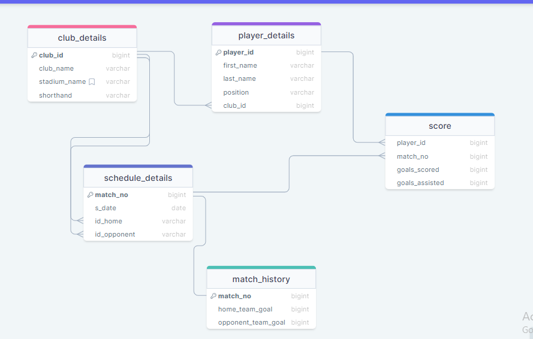

# Database-project-Football Tournament Management-Ehsanul-karim
This project is a football tournament management system designed to simplify the organization and management of football tournaments. It provides functionalities to create and manage clubs, players, schedules, scores, and match history.

## Features

- Club Management: Create, update, and delete football clubs. Assign stadiums to clubs.
- Player Management: Add, edit, and remove player details such as name, position, and injury status. Assign players to clubs
- Schedule Management: Create match schedules, including home and opponent teams, match dates, and match numbers.
- Score Management: Record goals scored and assisted by players in each match.
- Match History: View the history of matches along with goals scored by each team.

## Technologies Used

- Backend: Oracle Database, PL/SQL
- Frontend: Toad for oracle
- Other tools/libraries: [[(https://drawsql.app/)]]

## Screenshots

## Contributors

- [Ehsanul Karim_1907039] - [[(https://github.com/Ehsanul-karim))]

## Acknowledgements

- [gh repo shahidul034/BookList_database-project]

